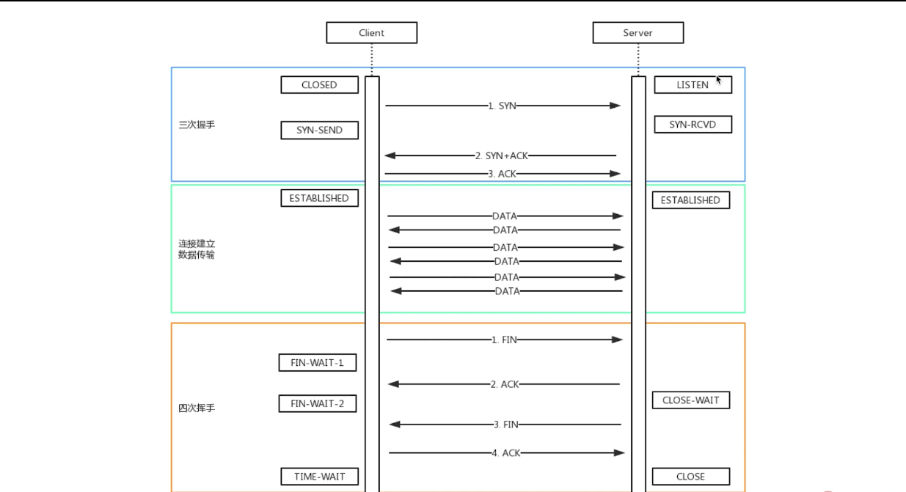
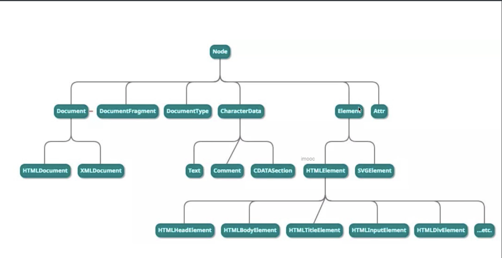
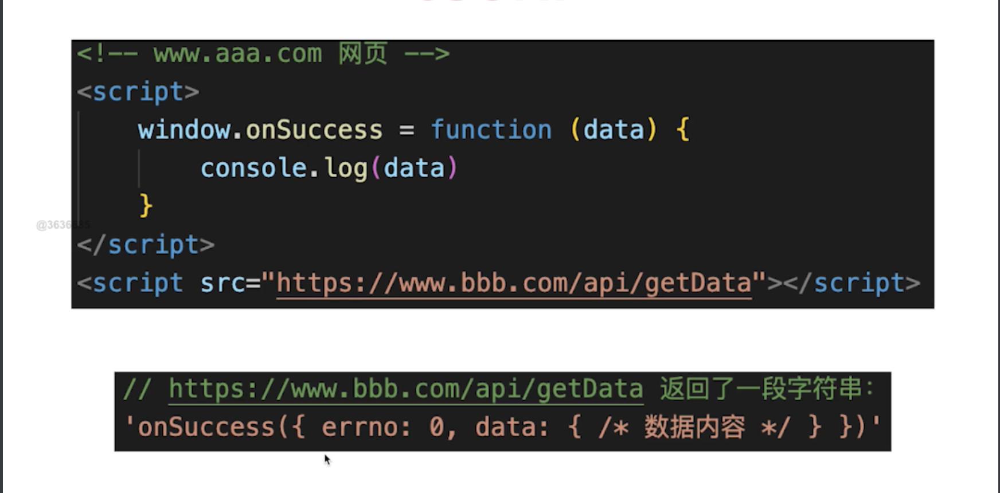
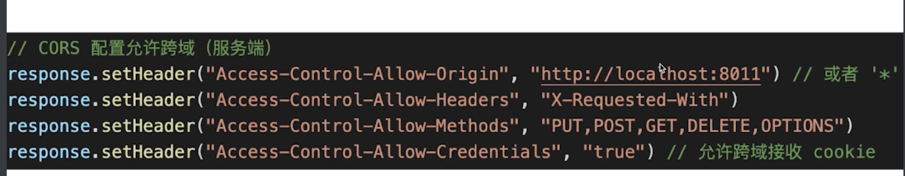
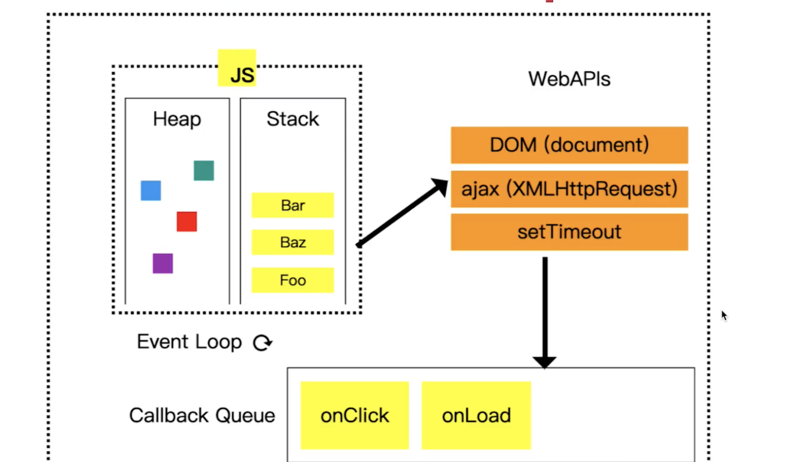
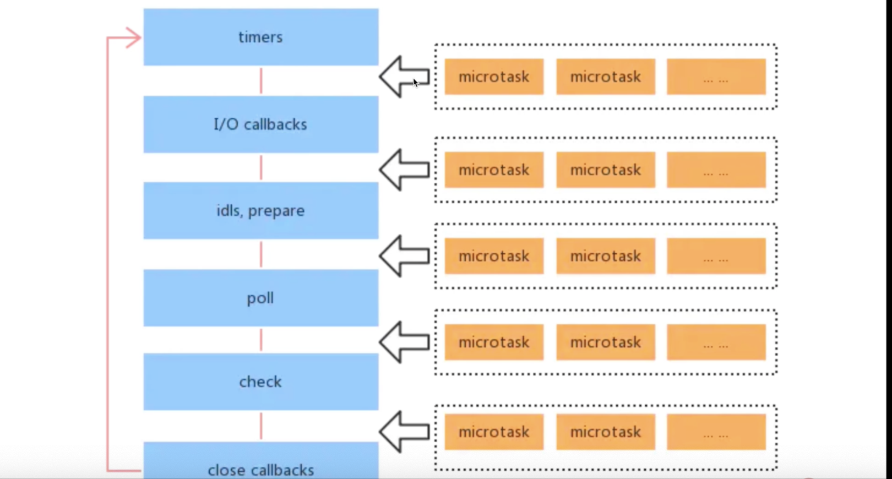

1. ajax fetch axios 区别
   相同点: 三者都用于网络请求, 但是不同维度
   
   1. ajax (asynchronous javascript and XML), 一种技术的统称
      1. 用XMLHttpRequest实现网络请求
      ```javascript
        const xhr = new XMLHttpRequest()
        xhr.open('get', url, false)
        xhr.onreadystatechange = () => {}
        xhr.send(null)
      ```
   2. fetch 一个具体的api
      1. 浏览器原生api, 用于网络请求
      2. 与XMLHttpRequest 一个级别的东西
      3. fetch语法更加简洁, 易用, 原生支持promise
   3. axios 一个第三方库
      1. 用来实现网络请求的一致性方案
      2. 浏览器端封装了XMLHttpRequest/fetch来实现
      3. node端封装了http的库
      4. 返回一个promise
   
2. 节流和防抖

   1. 防抖 防止抖动，例如在搜索框中输入时直到输入停止或者暂停时开始搜索 （限制执行次数）
   2. 节流 节省交互沟通，例如drag拖拽时或者scroll时可使用节流 （限制执行频率）

3. px % em rem vw/vh的区别

   1. px 绝对单位
   2. % 相对于父元素的百分比
   3. em 在font-size中使用是相对于父元素的字体大小，在其他属性中使用是相对于自身的字体大小，如width
   4. rem 相当于根节点（html）的font-size
   5. 100vw为屏幕宽度 100vh为屏幕高度 vmax为两者（vw, vh）中大的一个 vmin为两者中小的一个

4. 箭头函数的缺点, 哪里不能使用箭头函数

   1. 没有arguments
   2. 无法使用call, bind，apply改变this指向
   3. 某些箭头函数代码难以阅读
   4. 不能用来定义对象的方向
   5. 不适用原型链中的方法定义
   6. 不能作为构造函数
   7. Vue2生命周期和method

5. tcp三次握手、四次挥手

   1. 建立tcp连接
      1. 先建立连接（确保双方都有手法消息的能力）
      2. 再传输内容（如发送一个get请求）
      3. 网络连接是tcp协议，传输内容的是http协议
   2. 三次握手（确保双方都有发送和接收消息的能力）
      1. Client发包，server接收；server： 有client找我
      2. server发包， client接收；client：server已经收到消息了
      3. client发包， server接收；server： client要准备发送了
   3. 四次握手
      1. client发包，server接收；server： client已请求结束
      2. server发包， client接收；client： server已收到，我等待他关闭
      3. server发包， client接收；client： server此时可以关闭连接了
      4. client发包， server接收；server； 可以关闭了（断开链接）
   4. 

6. for...of 与 for...in

   1. 差异
      1. 遍历对象，for...in可以 , for...of 不可以
      2. 遍历Map，Set：for...in不可以 , for...of 可以
      3. 遍历generator，Set：for...in不可以 , for...of 可以
   2. for...in 用于**可枚举**的对象， 如对象、数组、字符串， 得到key
   3. For...of 用于**可迭代**的对象， Map、Set、数据、 字符串，得到value

7. for await...of有什么作用

   1. 用于遍历多个promise

8. offsetHeight scrollHeight clientHeight的区别

   1. Offsetheight = content + border + padding
   2. clientHeight = content + padding
   3. scrollHeight = padding + 实际内容尺寸

9. HTMLCollection 和 NodeList 的区别

   1. Dom是一棵树，所有节点都是Node

   2. Node是ELement的基类

   3. Element是其他html元素的基类，如HTMLDivElement

   4. 

   5. HTMLCollection是Element的集合， NodeList是Node的集合（都是类数组）

      ```javascript
      const p1 = document.getElementById('#p')
      console.log(p1.children instanceOf HTMLCollection) // true
      console.log(p1.childNodes instanceOf NodeList) // true (包含text和comment节点)
      ```

10. Vue computed 和 watch的区别

    1. computed用于计算产生新的数据
    2. watch 监听现有数据

11. vue组件通讯方式有几种?

    1. props和$emits (父子组件)
    2. 自定义事件 （eventbus） 
    3. $attrs （props和emits的补充集合）
    4. $parent(获取服组件)
    5. $refs（获取子组件）
    6. provide/inject （多层级通讯）
    7. Vuex（全局通信）

12. js严格模式的特点

    1.  全局变量必须要先声明
    2. 禁止用with
    3. 使用eval时会创建eval作用域
    4. 禁止this指向window
    5. 函数参数不能重名

13. http跨域请求时为什么要发送options请求

    1. 跨域请求
       1. 浏览器同源策略
       2. 同源策略一般限制ajax网络请求，不能跨域请求server
       3. 不会限制link img script iframe video 加载第三方资源
    2. jsonp
       1. 
    3. cors（服务端设置成可跨域）
       1. 
    4. 多余的options请求
       1. options请求，是跨域请求之前的预检查
       2. 浏览器自行发起的，无需我们干预
       3. 不会影响实际的功能

14. 如何检测js内存泄漏？js内存泄漏场景有哪些？

    1. 垃圾回收GC（garbage collection）
       1. 什么是垃圾回收
          1. 垃圾回收机制的原理是找到不再继续使用的变量，释放其内存。垃圾回收器会按照固定的时间间隔(或代码中预定的收集时间)，周期性地执行这一操作;
          2. Javascript 会找出不再使用的变量，不再使用意味着这个变量生命周期的结束。Javascript 中存在两种变量——全局变量和局部变量，全部变量的声明周期会一直持续，直到页面卸载;
          3. 而局部变量声明在函数中，它的声明周期从执行函数开始，直到函数执行结束。在这个过程中，局部变量会在堆或栈上被分配相应的空间以存储它们的值，函数执行结束，这些局部变量也不再被使用，它们所占用的空间也就被释放;
          4. 垃圾回收的两种实现方式：标记清除、引用计数
       2. 早期（ie9以下）： 引用计数（当引用计数为0时进行垃圾回收）bug: 循环引用就不会触发垃圾回收
       3. 标记清除（现代浏览器）
          1. 主要思想是给当前不使用的值加上标记，然后再回收他的内存;
          2. 垃圾回收器在运行时会给存储在内存中的变量加上标记，然后他会去掉环境变量和被环境变量引用的变量的标记，此后被加上标记的变量(环境变量中没有使用访问的变量)就是准备删除的变量;最后垃圾回收器完成清除工作，销毁那些带标记的值，并回收他们占用的内存空间;
          3. 标记和扫描算法经过：
             - 根节点：一般来说，根是代码中引用的全局变量;
             - 然后算法检查所有根节点和他们的子节点并且把他们标记为活跃的(意思是他们不是垃圾)。任何根节点不能访问的变量将被标记为垃圾;
             - 最后，垃圾收集器释放所有未被标记为活跃的内存块，并将这些内存返回给操作系统;

15. js内存泄漏如何检测？场景有哪些？

    1. 被全局变量，函数引用，组件销毁时未清除
    2.  被全局事件，定时器引用，组件销毁时未清除
    3. 被自定义事件引用，组件销毁时未清除

16. weakMap weakSet 弱引用

17. 浏览器和nodejs的事件循环有什么区别

    1. 单线程和异步
       1. js是单线程的（无论是在浏览器还是nodejs中）
       2. 浏览器中js执行和dom渲染是公用一个线程的
       3. 异步
    2. 宏任务和微任务
       1. 宏任务， setTimeout， setInterver, ajax
       2. 微任务， promise async/await mutationObserve
       3. 微任务是下一轮DOM渲染之前执行，宏任务在之后执行
       4. 
    3. nodejs事件循环
       1. nodejs同样使用es语法，也有单线程，也需要异步
       2. 异步任务也分宏任务+微任务
       3. 但是，他的宏任务和微任务，分不同类型，有不同优先级
       4. 宏任务类型和优先级(从高到低)
          1. Timers setTimtout setInterval
          2. I/O callbacks - 处理网络、留、Tcp的错误回调
          3. Idle, prepare - 限制状态（nodejs内部使用）
          4. Poll 轮询 - 执行poll中的I/O队列
          5. check检查 - 存储setImmediate回调
          6. Close callbacks - 关闭回调，如socket.io('close')
       5. 微任务类型和优先级
          1. 包括promise async/ await  process.nextTick()
          2. process.nextTick()优先级最高
       6. nodejs代码执行顺序
          1. 
          2. 同步代码
          3. 微任务（process.nexttick优先级最高）
          4. 宏任务，共有6种，每一种开始之前都会执行当前微任务（详见上图）

18. vdom

    1.  vdom并不快，js直接操作dom才是最快的
    2. 但“数据驱动视图”要有合适的技术方案，不能全部DOM重建
    3. vdom就是目前最合适的技术方案，并不是因为他块，而是合适

19. 遍历数组，for和forEach那个更快，时间复杂度都是o（n）

    1. for更快
    2. forEach 每次都要创建一个函数来调用，而for 不会创建函数
    3. 函数需要独立的作用域，会有额外的开销
    4. **越低级的代码， 性能往往越好

20. nodejs如何开启进程，进程如何通讯

    1. 进程process, 线程thread
    2. 进程： os进行资源分配和调度的最小单位，有独立内存空间
    3. 线程：os进行计算的最小单位，共享进行内存空间

21. Js-bridge jssdk就是一个经典的js-bridge的使用案例

    1.  urlScheme 的方式 native会拦截到webview的请求包括http和一些自定义的请求 weixin:// 等

22. requestAnimationFrame和requestIdleCallback

    1. requestAnimationFrame每次渲染完都会执行，高优
    2. requestIdleCallback空闲时才执行，低优
    3. 都是宏任务 都会等到当前dom渲染结束才会执行

23. vue每个生命周期都做了什么？

    1.  

24. vue2 vue3 react 三者的diff算法有什么区别

25. 
